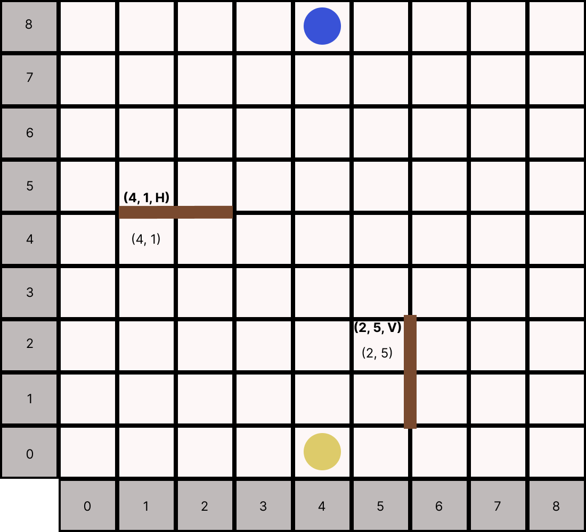

# Quoridor 

Reinforcement Learning environment for the game Quoridor

## Functionalities implemented

- simulating games
- saving and replaying simulations
- add own agent to simulate the game
- add an agent to the environment

### How to start?

To start program:
    python simulate.py

### Notation that the game currently uses:
- pawn_moves and positions are represented by a tuple (row, col) range is 0-8 
- fence moves (row, col, orientation) orientation is 'H' for horizontal or 'V' for vertical

Picture to clarify notations:

### pretty good to know:

Currently by default the HumanAgent is used as the player Agent, so you will have to make moves urself via the terminal.
commands are expected like this: {row}, {col} or for fence {row}, {col}, {orientation}. If you dont follow the format program will crash :)

TODO
- Translation function that converts my game notation to the "official" game notation: https://quoridorstrats.wordpress.com/notation/
- Environment compatible with OpenGym framework
- Adding smart agents

